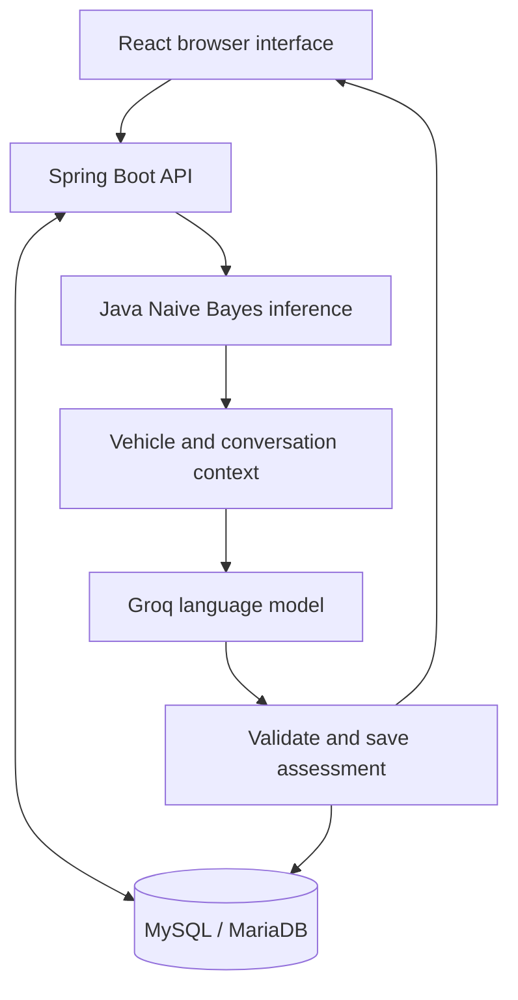

<div align="center">

# Smart Garage.AI
### AI Garage Assistant

**Vehicle-aware conversations · Hybrid machine learning · Workshop discovery**

A Group 09 academic prototype combining a trained Naive Bayes classifier with a language model to help users understand vehicle symptoms and find repair workshops.

**React · Spring Boot · MySQL/MariaDB · Python · Groq**

[Getting Started](#getting-started-windows) · [How It Works](#how-it-works) · [ML Evaluation](#machine-learning-and-evaluation) · [Team](#team-contributions)

</div>

> **Project status:** locally runnable academic prototype. This repository contains the application source, not a hosted website. Assessments and repair estimates support preliminary investigation and do not replace a mechanic's inspection.

## Features

| Feature | What the application provides |
|---|---|
| Account access | Registration, login, logout and server-validated bearer sessions |
| Vehicle management | Saved vehicle details and mandatory vehicle selection before diagnosis |
| Hybrid diagnosis | Locally trained fault classification combined with contextual Groq responses |
| Multi-turn conversations | Follow-up questions, saved history and separate vehicle/session contexts |
| Multilingual interaction | English, Tamil and Sinhala conversation; browser-supported voice input |
| Repair-cost estimates | Optional approximate LKR ranges with assumptions and an AI-estimate label |
| Garage Finder | Local workshop directory, location detection, straight-line distances and live position tracking |
| Navigation | External Google Maps directions to the selected workshop |
| Administration | User inspection, catalogue/workshop management and reviewed ML retraining |

## How it works

1. The user logs in and selects a registered vehicle.
2. The backend validates vehicle ownership and retrieves the current conversation context.
3. A trained **Multinomial Naive Bayes** classifier predicts a fault-category hint from the user's symptoms.
4. **Groq (`openai/gpt-oss-20b`)** receives the vehicle details, category hint and conversation context.
5. The assistant asks a clarification or returns an assessment with possible causes, driving guidance and optional repair-cost information.
6. The backend saves the conversation and structured assessment. The user can then explore workshops and open directions.

Weak or unknown classifier evidence can produce no category hint. The language model may disagree with the classifier; it is not forced to repeat an unsupported category.



Python is used for training and evaluation. **No separate Python API server is required.** Java performs local inference using exported JSON weights. Groq responses and map services require Internet access.

## Technology stack

| Layer | Technology |
|---|---|
| Frontend | React 18, Vite 6, React Router 7 |
| Backend | Java 17, Spring Boot, Maven Wrapper |
| Persistence | MySQL/MariaDB; XAMPP in the demonstrated Windows environment |
| Machine learning | Multinomial Naive Bayes, Python standard-library training, Java inference |
| Language generation | Groq API |
| Maps | Leaflet, OpenStreetMap tiles, Google Maps directions handoff |
| Voice and location | Browser speech and geolocation capabilities |

## Getting started (Windows)

These instructions create a **new local installation**. Existing users should keep their database and follow [Existing database updates](#existing-database-updates).

### 1. Install prerequisites

| Requirement | Purpose |
|---|---|
| JDK 17 or newer | Compile and run the backend; `javac` must be available |
| Node.js 20 or newer with npm | Install and run the frontend |
| XAMPP | Run MySQL/MariaDB and optionally phpMyAdmin through Apache |
| Python 3.8 or newer | ML retraining and verification; not needed for Java inference alone |
| Groq API key | Enable language-model responses using your own account |
| Modern browser | Use the interface; speech support varies by browser |

VS Code or Antigravity is optional. Neither an AI subscription nor an available agent quota is required to run the application. Git is optional when downloading a ZIP. Maven is supplied through the backend wrapper.

After installing software, reopen your terminal and check:

```powershell
java -version
javac -version
node -v
npm.cmd -v
python --version
```

If a command is not recognized, check installation/PATH before continuing.

### 2. Download and open the project

**Without Git:** on this repository, choose **Code → Download ZIP**, then **Extract All**. Open the extracted folder containing `backend`, `frontend`, `database` and `ml`. This is the **project root**.

**With Git:**

```powershell
git clone https://github.com/Garage-Group09/AI-Garage-Assistant.git
cd AI-Garage-Assistant
```

In VS Code or Antigravity, choose **File → Open Folder** and select the project root. Open a terminal through **Terminal → New Terminal**. Alternatively, type `cmd` in File Explorer's address bar while viewing the root folder.

### 3. Create the database

1. Open **XAMPP Control Panel** and start **Apache** and **MySQL**.
2. Open `http://localhost/phpmyadmin` in your browser. Use your configured Apache port if it differs.
3. Click **New**, enter `vehicle_diagnosis_db`, select a UTF-8 collation such as `utf8mb4_unicode_ci`, and click **Create**.
4. Select that database from the sidebar.
5. Choose **Import → Choose File**, select `database/schema.sql`, then click **Go/Import**. Wait for success.
6. Repeat the import with `database/seed_data_anonymized.sql`.

The seed provides catalogue/workshop data, not shared login accounts. The current fresh schema contains the required columns. Do not import schema or seed over an existing database.

MySQL must run while using the app. Apache is needed for phpMyAdmin, not for Spring Boot itself.

### 4. Configure the API key and database connection

Open `backend/src/main/resources`:

1. Copy `application-secret.properties.example`.
2. Rename the copy to **application-secret.properties**.
3. Replace the example Groq key with your own valid key and save.

Enable **File name extensions** in Windows Explorer to avoid accidentally creating `application-secret.properties.txt`.

```properties
groq.api.key=YOUR_GROQ_API_KEY
```

The default database configuration targets `vehicle_diagnosis_db` on `localhost:3306`, username `root`, with an empty password. If your settings differ, add overrides to the secret file:

```properties
spring.datasource.url=jdbc:mysql://localhost:3306/vehicle_diagnosis_db
spring.datasource.username=YOUR_DATABASE_USER
spring.datasource.password=YOUR_DATABASE_PASSWORD
```

Use your actual local values. The secret file is ignored by Git; do not commit or share it. AI responses require Internet access and available provider quota.

### 5. Install frontend dependencies

From a terminal at the **project root**:

```powershell
cd frontend
npm.cmd ci
```

Wait for completion. Run this on first installation or after dependency updates, not every time you start the app.

### 6. Start the backend and frontend

Open **two separate terminals**, each initially at the project root. Keep both open while using the app.

**Terminal 1 — backend:**

```powershell
cd backend
.\mvnw.cmd spring-boot:run
```

Wait for the Spring Boot **Started** message. The backend normally listens on port **8080**. Initial dependency downloads may take several minutes.

**Terminal 2 — frontend:**

```powershell
cd frontend
npm.cmd run dev -- --host
```

Open the exact **Local URL** printed by Vite, including its `http` or `https` scheme. The usual frontend port is **5173**. Frontend `/api` requests are proxied to the backend on port 8080.

These commands work in Windows PowerShell and CMD. No startup scripts are required.

### 7. Try the application

1. **Register** an account and **log in**.
2. Open **Vehicle**, enter the required details and save.
3. Open **Diagnosis** and select your vehicle.
4. Describe a symptom, for example: “My brakes squeak when I slow down.”
5. Answer the assistant's clarifying questions.
6. Review the assessment and approximate cost, or the Unavailable state.
7. Open **Find Nearby Workshops**, allow location access if desired, and select a garage.
8. Choose **Navigate (Maps)** to open Google Maps directions.

### Starting again on another day

Start XAMPP **MySQL**, then run the backend and frontend commands in separate terminals. Open the frontend URL and log in. Database import, dependency installation and model training do not need to be repeated.

To stop, press **Ctrl+C** in each server terminal. If prompted to terminate the batch job, enter **Y**. Stop MySQL when no application needs it. Saved database records and model files remain on disk; restarting the backend clears in-memory login sessions.

## Administrator setup

Normal registration creates a customer account. To prepare an administrator for a local demonstration, the database owner can register the account, select the database in phpMyAdmin, open **SQL**, and run:

```sql
UPDATE users SET Is_Admin = 1 WHERE email = 'your-registered-email@example.com';
```

Replace the email with the account you registered, then log out and back in. The administrator can inspect user records, manage workshops/catalogue data, and review ML examples. Password hashes are excluded from the inspection response.

## Phone demonstration

The PC must keep MySQL and both servers running. Connect the phone and PC to the same local network and open Vite's **Network URL** on the phone. Do not use `localhost` on the phone: it refers to the phone itself.

Same-network access also depends on firewall and hotspot/router isolation settings. Allow the development server on the trusted private network rather than disabling the whole firewall. Mic and location features may require a trusted HTTPS connection and browser permission. A certificate-warning bypass alone does not establish API availability. Never share a private certificate key.

Phone access to your PC uses your PC's database. A separate installation on another computer has independent accounts and data. This project is not currently a shared Internet deployment.

## Machine learning and evaluation

### Dataset and classifier

The [dataset](ml/data/vehicle_symptoms_dataset.json) contains **112 English examples**, 16 per category:

- Air conditioning
- Brake system
- Cooling system
- Electrical and battery
- Engine mechanical
- Tires and suspension
- Transmission

Supplied provenance labels identify 70 academic seed examples and 42 synthetic variations. Exact reference citations and paraphrase-group identifiers were not supplied with the dataset. It is an illustrative academic benchmark, not a verified collection of mechanic-confirmed repairs.

Multinomial Naive Bayes uses bag-of-words counts and Laplace smoothing (`alpha = 1`). A deterministic seed-42 stratified split produces **91 training examples and 21 evaluation examples**. Vocabulary is learned from training data only.

### Results

| Measure | Committed baseline v1.0.0 | Demonstrated local candidate |
|---|---:|---:|
| Training examples | 91 | 93 |
| Evaluation examples | 21 | 21 |
| Accuracy | 61.90% | 71.43% |
| Macro F1 | 0.5976 | 0.7095 |

The [baseline evaluation report](ml/models/evaluation_report_v1.0.0.json) includes per-class metrics and the confusion matrix. The candidate result was observed in the local admin interface on 24 September 2026. The repository distributes the baseline; private candidate data/state is not included.

The small evaluation set is reused for model selection, so it is a **development benchmark**, not an independent final test. Exact evaluation-text overlaps are rejected, but near-paraphrase leakage is not ruled out. These scores do not establish real-world diagnostic accuracy.

### Reviewed retraining

1. Open **Admin Panel → ML Model**.
2. Review a completed diagnosis, correct the category, and edit the symptom into anonymized English.
3. Explicitly approve or reject the example.
4. Select **Train approved examples**.
5. Deduplicated approved examples are added to training. Candidate accuracy and macro F1 must both meet or exceed baseline thresholds to activate.
6. A rejected candidate preserves the previous serving model. **Restore baseline model** restores v1.0.0.

Chat storage does not automatically train the model. LLM-generated labels are not automatically ground truth. Training the classifier does not fine-tune Groq, and activation does not guarantee improvement over every previous candidate.

## Testing and verification

Run each block from the indicated location. The commands replace the removed verification shortcut.

**From the project root — Python tests, baseline evaluation and Java/Python scoring parity:**

```powershell
python -m unittest discover -s ml/tests -v
python ml/evaluate.py ml/models/nb_model_v1.0.0.json
python ml/verify_inference.py
```

The explicit model path evaluates the baseline. Without it, `evaluate.py` evaluates the current local serving model. Parity compares production Java/Python scoring on 12 fixtures; it measures implementation agreement, not diagnostic accuracy.

**From the project root — selected database-independent Java tests:**

```powershell
cd backend
.\mvnw.cmd "-Dtest=NaiveBayesServiceTest,DiagnosisLogicTest" test
```

**In another terminal at the project root — frontend build and dependency audit:**

```powershell
cd frontend
npm.cmd run build
npm.cmd audit
```

Recorded Windows verification on 24 September 2026: **7 Python tests passed**, **12 scoring-parity fixtures passed**, **4 Java unit tests passed**, and the updated frontend production build passed. The dependency audit reported **0 vulnerabilities at that time**; this is not a complete application security audit.

Manual demonstration evidence includes login, vehicle gating, multi-turn diagnosis, restored history/cost cards, location display, external directions and reviewed retraining. Phone networking and permissions should be verified on the actual demonstration device.

## Database and project structure

| Directory | Contents |
|---|---|
| `backend/` | Spring Boot API, authentication, persistence, Java classifier and tests |
| `frontend/` | React interface, styles and Vite configuration |
| `database/` | Fresh schema, catalogue seed and additive migrations |
| `ml/` | Dataset, training/evaluation scripts, baseline model and tests |

The database has nine tables: `users`, `vehicle_brand`, `vehicle_model`, `vehicle`, `symptom`, `diagnosis`, `chat_history`, `garage`, and `garage_recommendation`. See [schema.sql](database/schema.sql) for column definitions and declared constraints.

### Existing database updates

Back up your database before applying a schema change. Select the intended existing database and apply only the required additive migration, such as [2026_09_24_safe_update.sql](database/migrations/2026_09_24_safe_update.sql). Do not re-import fresh schema/seed over existing records.

Hibernate automatic schema mutation is disabled (`ddl-auto=none`); schema changes use explicit migrations. Optional or historically unavailable fields may remain NULL. Missing facts are not replaced with fabricated values.

## Troubleshooting

| Problem | Action |
|---|---|
| Command not recognized | Verify the software is installed/on PATH, then reopen the terminal |
| PowerShell blocks `npm.ps1` | Use `npm.cmd` as shown above |
| `'vite' is not recognized` | Run `npm.cmd ci` in `frontend` before starting it |
| `EPERM` mentions `esbuild.exe` | Stop frontend processes before installing; if necessary restart Windows and install before launching the app |
| Database connection failure | Check MySQL is running and database name, port and credentials match |
| Backend port already in use | Stop the earlier backend instance before starting another |
| AI response fails | Check your Groq key, network, quota and backend error; do not share the key |
| Login expires after restart | Expected: backend sessions are in memory; log in again |
| Phone cannot open the app | Check the PC's Network URL, private-network firewall access and hotspot/router isolation |
| Voice/location unavailable | Check browser support, permissions and trusted secure connection |

## Scope and limitations

- Workshop discovery uses a **local directory**, not a live Places API. Directory details need independent verification.
- In-app distances are straight-line approximations; Google Maps provides external road directions.
- Repair prices are approximate AI estimates, not verified garage quotations or live market prices.
- The diagnosis card's AI self-estimate is distinct from classifier probabilities and measured evaluation accuracy.
- The Naive Bayes dataset is English-only; multilingual conversation relies on Groq and browser speech support.
- A shared hosted service, broader validated datasets and production hardening are future work.

## Team contributions

The following contributions are reported by the project team. Collaborative testing, UI assistance and documentation can include work that is not represented by individual Git commits.

| Member | Contribution area |
|---|---|
| Mohamed Ibrahim Mohamed Isfak | Full-stack integration and ML architecture |
| Sasika Dinushankha | Backend security and core services |
| Sanduni Navodya Thilakasiri | Administration and frontend UI |
| Maryam Mohamed Mihlar | Database design and data modelling |
| Nayanajith | Manual testing across login, registration, vehicle, diagnosis and garage pages; UI assistance with confirm-password and admin forms; setup documentation |

## Repository hygiene

Keep source code, maintained tests, dataset provenance, schema/migrations and baseline evaluation artifacts in version control. Exclude secrets, private certificates, personal SQL backups, private reviewed examples, runtime candidates, caches, dependencies and build outputs.

Local retraining can modify `backend/src/main/resources/nb_model.json`. Preserve the intended local model when updating or staging files; do not blindly restore or publish it. A GitHub push does not upload the live database or host the application.
